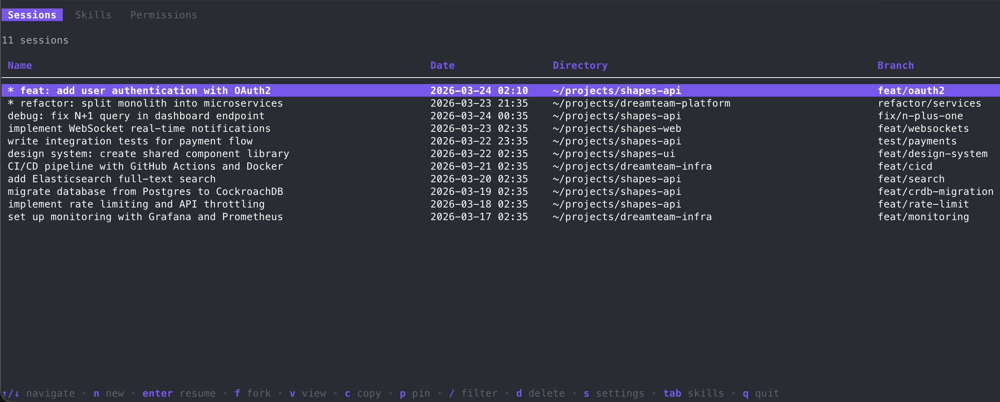

<p align="center">
  <h1 align="center">tracer</h1>
  <p align="center">
    A terminal UI for managing your <a href="https://docs.anthropic.com/en/docs/claude-code">Claude Code</a> sessions, skills, and permissions.
    <br />
    <br />
    
    
    
  </p>
</p>

<br />

<p align="center">
  
</p>

<br />

## Why tracer?

Claude Code stores your sessions as raw JSONL files scattered across `~/.claude/`. tracer gives you a fast, searchable interface to **browse**, **resume**, **fork**, and **manage** all of them — plus your skills and permission rules — without leaving the terminal.

## Quick Start

```bash
curl -fsSL https://raw.githubusercontent.com/TheDokT0r/tracer/master/install.sh | sh
```

Then just run `tracer`.

<details>
<summary>Other install methods</summary>

**Go install**
```bash
go install github.com/TheDokT0r/tracer@latest
```

**From source**
```bash
git clone https://github.com/TheDokT0r/tracer.git
cd tracer && go build -o tracer .
```

**Manual download** — grab the latest `.tar.gz` from [Releases](https://github.com/TheDokT0r/tracer/releases).

</details>

## Features

### Sessions

| Action | How |
|--------|-----|
| Browse all sessions | Just launch `tracer` |
| Filter by name, directory, or branch | `/` then type |
| Resume a session | `Enter` |
| Fork a session (new ID, same conversation) | `f` |
| Start a new session | `n` |
| View details (context usage, conversation) | `v` |
| Rename a session | `r` in detail view |
| Edit session file | `e` in detail view |
| Pin to top | `p` |
| Copy session ID | `c` |
| Delete | `d` |

### Skills

Press `Tab` to switch to the Skills tab.

| Action | How |
|--------|-----|
| Browse all skills (user, project, plugin) | Skills tab |
| View skill content | `Enter` or `v` |
| Edit a skill | `e` |
| Create a new skill | `n` |
| Delete a skill | `d` |

Plugin skills are read-only.

### Permissions

Press `Tab` again to reach the Permissions tab.

| Action | How |
|--------|-----|
| Browse all settings files (global + project) | Permissions tab |
| View allow/deny rules | `Enter` or `v` |
| Add a new rule | `a` |
| Toggle allow/deny | `t` |
| Delete a rule | `d` |

Changes save immediately to `settings.json`.

### Themes

12 built-in themes. Preview them interactively:

```bash
tracer theme
```

Available: `default` `minimal` `mono` `ocean` `rose` `forest` `sunset` `nord` `dracula` `solarized` `monokai` `catppuccin`

### Command Palette

Press `:` in any view to open the command palette. Type commands with autocomplete:

```
:sort name          Sort sessions by name
:set theme dracula  Switch theme
:export html        Export session as HTML
:filter react       Filter by "react"
:help               List all commands
```

Dropdown suggestions appear above the input. Ghost text (dimmed inline suggestion) can be enabled in settings. Command history persists across sessions — use `Up/Down` to recall previous commands.

### Settings

Press `s` or run `tracer settings`.

| Setting | Default |
|---------|---------|
| Theme | default |
| Sort by | date |
| Show date column | on |
| Show directory column | on |
| Show branch column | on |
| Confirm before delete | on |
| Auto-update | off |
| Command dropdown | on |
| Ghost suggestions | off |
| Max suggestions | 8 |

## Commands

```
tracer                Launch the TUI
tracer update         Update to the latest release
tracer theme          Interactive theme picker
tracer theme <name>   Set theme directly
tracer settings       Open settings
tracer man            View the manual page
tracer -v             Print version
```

## How It Works

tracer reads from `~/.claude/`:

- **Sessions** — JSONL files in `projects/` scanned in parallel (only first message read for speed)
- **Skills** — `skills/`, `commands/`, and `plugins/cache/`
- **Permissions** — `settings.json` at global, project, and local scopes

Full session details (token counts, conversation history) load on demand. Auto-update checks run in the background and apply after you exit.

## License

MIT

